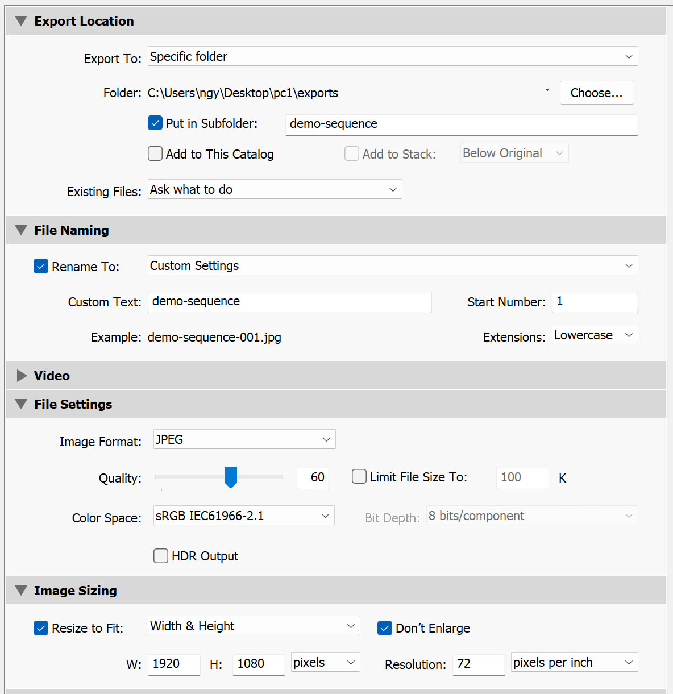
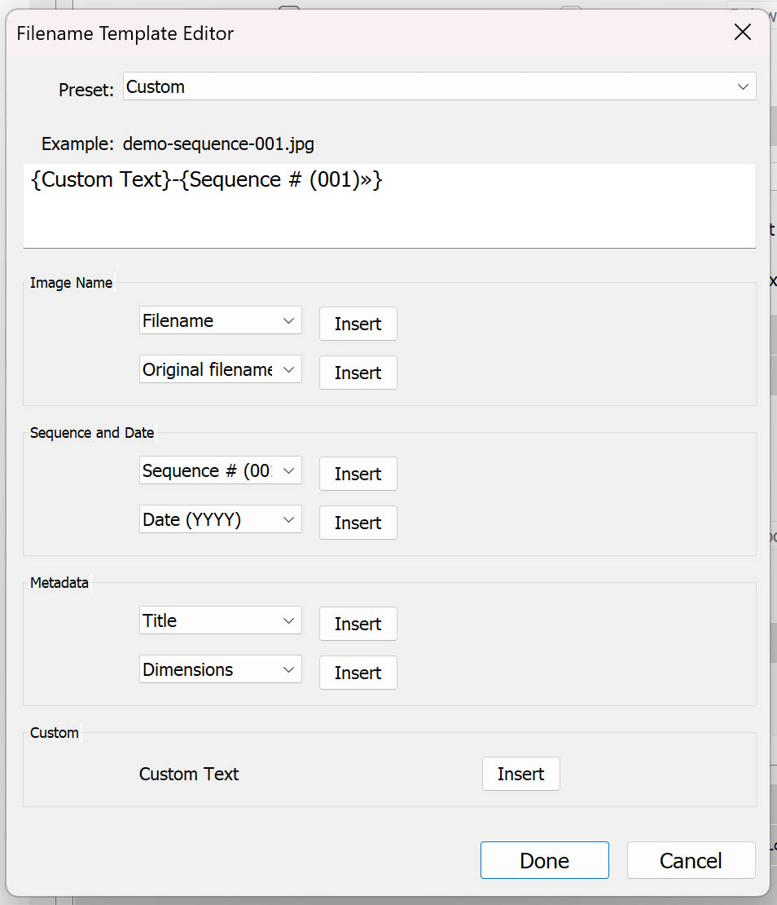

# 582-104-va-photo-cinema

Notes for the Photo &amp; Cinematography class

## Lightroom export settings

## Camera movements

[What Happens to a Movie Without a Camera Operator?](https://www.youtube.com/watch?v=Kq_qBUeSLl4&ab_channel=VanityFair)

## Storyboards

[What is a storyboard?](https://www.youtube.com/watch?v=6aTnEanIXBk)

[Intro to Storyboarding](https://www.youtube.com/watch?v=RQsvhq28sOI)

[PARASITE - Storyboard to Film](https://www.youtube.com/watch?v=Qq36iIb8V8o)

[Storyboard: Parasite's Montage Scene](https://vimeo.com/398814689)
​
[Lessons From The Parasite Storyboards](https://www.youtube.com/watch?v=JE26E4IM_-g&ab_channel=ThomasFlight)

### Storyboard Templates

[Free Storyboard Templates](https://boords.com/storyboard-template)

### Cheatsheet

[Camera Angles Cheatsheet](https://downloads.boords.com/boords-camera-angles.pdf)

### Bonus

[Watch Disney Animation’s Head Of Story Share Animation Secrets & Sketch](https://www.youtube.com/watch?v=IomgUWKjUxA&ab_channel=SYFY)

[The Purpose Of Storyboarding](https://www.youtube.com/watch?v=BSOJiSUI0z8&ab_channel=picassosson)

## Continuity - 180 Degree Rule

[Cinematographer Explains 3 Different Camera Lenses | Vanity Fair](https://www.youtube.com/watch?v=DGujsKb2e10&ab_channel=VanityFair)

[Film School: Establishing Film Continuity](https://www.youtube.com/watch?v=ALguEHV9VvA&ab_channel=NewYorkFilmAcademy)

[What Happens When A Movie Has No Script Supervisor?](https://www.youtube.com/watch?v=NAvn7CNpdB8&ab_channel=VanityFair)

## Lighting

[What Happens When A Movie Has No Gaffer?](https://www.youtube.com/watch?v=wXcc79AmkyU&ab_channel=VanityFair)

[Portrait Fundamentals: Lighting Patterns](https://www.digitalphotomentor.com/lessons/portrait-lighting-lighting-patterns/)

## Perspective

[Cinematic blend between subjective and objective POV](https://www.youtube.com/watch?v=u-Rdh1K-jEE&ab_channel=JanStripek)

### Exercise demo / example

## Camera Basics

[Cameras and Lenses](https://ciechanow.ski/cameras-and-lenses/)
